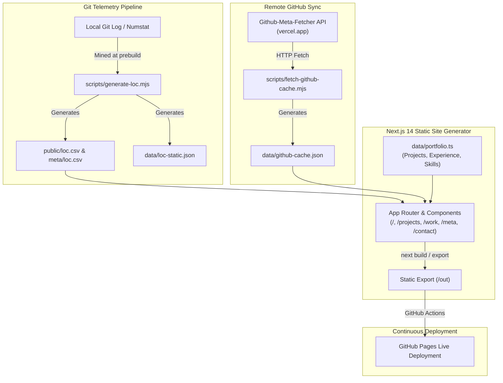

<div align="center">

  

  # Ishaan Koradia — AI & Data Science Portfolio

  *An interactive 3D WebGL portfolio, real-time telemetry engine, and AI engineering showcase.*

  <p align="center">
    <a href="https://ishaankor.github.io/my-data-science-portfolio/"><strong>Explore Live Portfolio »</strong></a>
  </p>

  <p align="center">
    
    
    
    
    
    
    
  </p>

  <p align="center">
    <a href="https://ishaankor.github.io/my-data-science-portfolio/">🚀 Live Demo</a> •
    <a href="https://linkedin.com/in/ishaankoradia">💼 LinkedIn</a> •
    <a href="https://github.com/ishaankor">🐙 GitHub</a> •
    <a href="mailto:ishaankoradia@gmail.com">📬 Email</a>
  </p>

</div>

---

## 🌟 Overview & Philosophy

This repository contains the source code for the personal engineering portfolio of **Ishaan Koradia** (AI Engineer & Data Science Developer).

Unlike traditional static developer resumes, this project is architected as an **interactive data product**:
- **Real-Time Telemetry**: Automatically mines commit history from git logs to compute lines-of-code (LOC) metrics, file modifications, and author timelines.
- **Companion Microservice Integration**: Seamlessly pulls and synchronizes live GitHub contribution statistics from [Github-Meta-Fetcher](https://github-meta-fetcher.vercel.app/api/github).
- **Interactive 3D WebGL Canvas**: Features custom Three.js scenes, an interactive 3D physics-based tilt and flip Memoji card, and custom cursor haze tracking.
- **Midnight Haze Aesthetic**: Built on a curated dark palette blending obsidian space tones (`#090d16`), neon cyan (`#38bdf8`), luminous violet (`#a855f7`), and signature ember orange accents (`#f97316`).

---

## 📐 Architecture & Data Pipelines



---

## ✨ Key Features

### 1. 🎮 Interactive 3D Memoji Hero Card
- **Physics-Based Tilt & Parallax**: Dynamically tracks cursor coordinates with real-time 3D rotation (`rotateX`, `rotateY`) and dynamic specular sheen gradients.
- **180° Flip Mechanics**: Flips between the animated visual Memoji avatar and an executive summary card with custom keyboard accessibility (`Enter`/`Space`) and touch support.
- **Midnight Haze Cursor**: A smooth canvas-based cursor trail that responds fluidly to hover states and clickable targets.

### 2. 📊 Live GitHub Analytics & Codebase Evolution
- **Repository Telemetry**: Computes aggregate metrics (total commits, additions, deletions, net LOC) across time.
- **Dynamic Language Breakdown**: Visualizes language distributions and project velocities across multiple repositories.
- **Interactive Scatter & Timeline Charts**: Built with modern SVG charting components for smooth scrubbing and inspection.

### 3. 💼 Filterable Project Showcase
- Categorized across **Machine Learning**, **AI & Web**, **Automation**, and **Data Visualization**.
- Live filter controls with real-time state transitions and high-resolution visual previews.
- Impact metric callouts (e.g., *10,000+ users*, *25,000+ weekly requests*, *~95% strategy accuracy*).

### 4. 🧭 Career Pathway & Industry Experience
- Detailed trajectory highlighting AI Engineering at **Handshake AI** (Frontier LLM golden benchmarks, NVIDIA Nemotron-12B collaboration), **Verizon** (1st place innovation award in computer vision), and **UC San Diego** (B.S. in Cognitive Science — Machine Learning & Neural Computation, GPA 3.76).
- Verified credentials from Anthropic (Model Context Protocol: Advanced Topics), Google (IT Automation with Python), and DataCamp (AI Engineer Associate).

---

## 🛠️ Featured Engineering Projects

| Project | Domain | Key Technologies | Highlights |
| :--- | :--- | :--- | :--- |
| **[Transformi! ML Discord Bot](https://github.com/ishaankor/Transformi)** | Machine Learning | Python, TensorFlow, scikit-learn, asyncio, Discord API | Parallelized ETL pipeline for automated regression modeling and live chat scatter plots serving 10,000+ users. |
| **[Datafy AI Copilot](https://github.com/ishaankor/Datafy)** | AI & Web Platforms | Python, LangChain, FastAPI, Pandas, Next.js | AI data canvas transforming raw CSVs into interactive charts and executive briefs; handles 25,000+ weekly requests. |
| **[IshaanBot](https://github.com/ishaankor/my-personal-website)** | Agentic AI & MCP | Python, Gemini API, FastAPI, Docker, FastMCP | Modular assistant implementing Model Context Protocol (MCP) with 15+ composable tools and streaming inference. |
| **[Daily Motivation Bot](https://github.com/ishaankor/Daily-Motivation-)** | Automation | Python, PostgreSQL, Twitter API, NLP | Automated social bot logging engagement analytics to PostgreSQL with automated cron execution. |
| **[Canvas Files Merger](https://github.com/ishaankor/Canvas-Files-Merger)** | Automation & CLI | Python, PDF Processing, CLI | Batch-compilation utility organizing LMS coursework downloads into indexed, unified PDF portfolios. |

---

## 💻 Tech Stack & Architecture

```
Frontend Architecture      Next.js 14 (App Router, Static Export), React 18, TypeScript 5
3D Graphics & Visuals      Three.js, @react-three/fiber, @react-three/drei
Styling & Design System    Tailwind CSS, Midnight Haze Tokens, CSS Modules
Animation & Transitions    Framer Motion, CSS 3D Transforms
Telemetry & Tooling        Node.js ESM Scripts, Child Process Git Numstat Mining, REST Fetch
Typography                 Inter (Google Fonts), JetBrains Mono
Deployment & CI/CD         GitHub Pages, GitHub Actions Automation Workflow
```

---

## 📁 Repository Structure

```
my-data-science-portfolio/
├── app/                          # Next.js 14 App Router
│   ├── layout.tsx                # Root layout, metadata & favicon configurations
│   ├── page.tsx                  # Home page layout
│   ├── globals.css               # Midnight Haze global tokens & animations
│   ├── projects/                 # Comprehensive project library
│   ├── work/                     # Career pathway & systems experience
│   ├── meta/                     # Repository telemetry & LOC evolution analytics
│   ├── resume/                   # Interactive resume page
│   └── contact/                  # Contact & messaging console
├── components/                   # Modular React UI components
│   ├── analytics/                # GitHub telemetry & activity visualizers
│   ├── experience/               # Career timeline & certification cards
│   ├── hero/                     # 3D interactive Memoji & agentic console
│   ├── layout/                   # Navbar, Footer, and responsive navigation
│   ├── projects/                 # Project showcase cards & category filters
│   └── ui/                       # Cursor haze, wave text, and scroll reveal
├── data/                         # Portfolio datasets & live caches
│   ├── portfolio.ts              # Primary data store (projects, bio, experience)
│   ├── github-cache.json         # Synced repository analytics
│   └── loc-static.json           # Cached lines-of-code telemetry
├── public/                       # Static public assets
│   ├── logo.png                  # Master portfolio brand logo
│   ├── favicon.ico               # Multi-resolution icon (16x16, 32x32, 48x48)
│   ├── favicon.png               # 32x32 transparent favicon
│   ├── favicon.svg               # Vector SVG icon
│   ├── apple-touch-icon.png      # 180x180 iOS Safari touch icon
│   ├── icon-192.png              # 192x192 PWA web icon
│   ├── icon-512.png              # 512x512 high-resolution icon
│   └── images/                   # Project previews & photography
└── scripts/                      # Prebuild automation scripts
    ├── generate-loc.mjs          # Extracts complete git log & LOC history to CSV/JSON
    └── fetch-github-cache.mjs    # Fetches live metadata from Github-Meta-Fetcher API
```

---

## 🚀 Getting Started

### Prerequisites
- **Node.js** >= 18.17.0
- **npm** >= 9.0.0
- **Git** (required for LOC telemetry extraction)

### Installation

1. Clone the repository:
   ```bash
   git clone https://github.com/ishaankor/my-data-science-portfolio.git
   cd my-data-science-portfolio
   ```

2. Install dependencies:
   ```bash
   npm install
   ```

3. Start the local development server:
   ```bash
   npm run dev
   ```
   *Note: `npm run dev` automatically runs `scripts/generate-loc.mjs` before launching Next.js on [http://localhost:3000](http://localhost:3000).*

### Building for Production

To generate the static production export for GitHub Pages deployment:

```bash
npm run prebuild    # Updates lines-of-code telemetry and fetches latest GitHub cache
npm run build       # Executes Next.js static export into the /out directory
```

---

## 👤 Author & Contact

**Ishaan Koradia**
- **Role**: AI Engineer & Data Science Developer
- **Alma Mater**: University of California, San Diego (B.S. in Cognitive Science — ML & Neural Computation, Minor in Data Science)
- **Email**: [ishaankoradia@gmail.com](mailto:ishaankoradia@gmail.com)
- **LinkedIn**: [linkedin.com/in/ishaankoradia](https://linkedin.com/in/ishaankoradia)
- **GitHub**: [@ishaankor](https://github.com/ishaankor)
- **Live Portfolio**: [ishaankor.github.io/my-data-science-portfolio](https://ishaankor.github.io/my-data-science-portfolio/)

---

## 📄 License

This project is licensed under the [MIT License](LICENSE).
